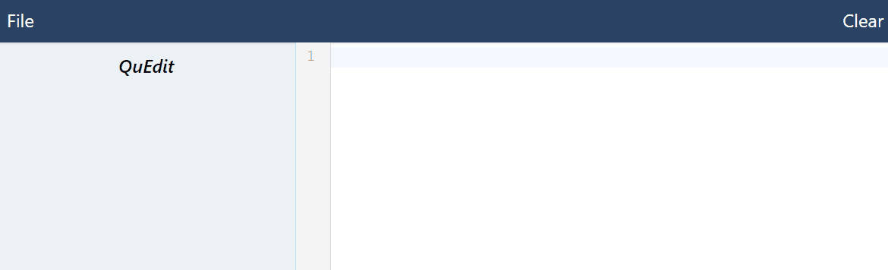
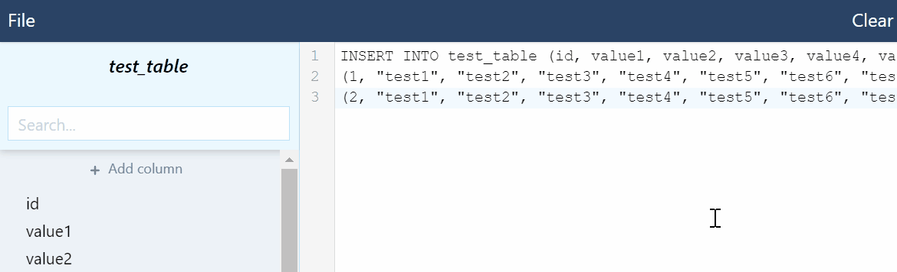
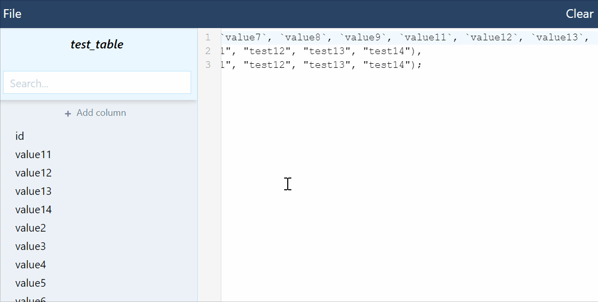
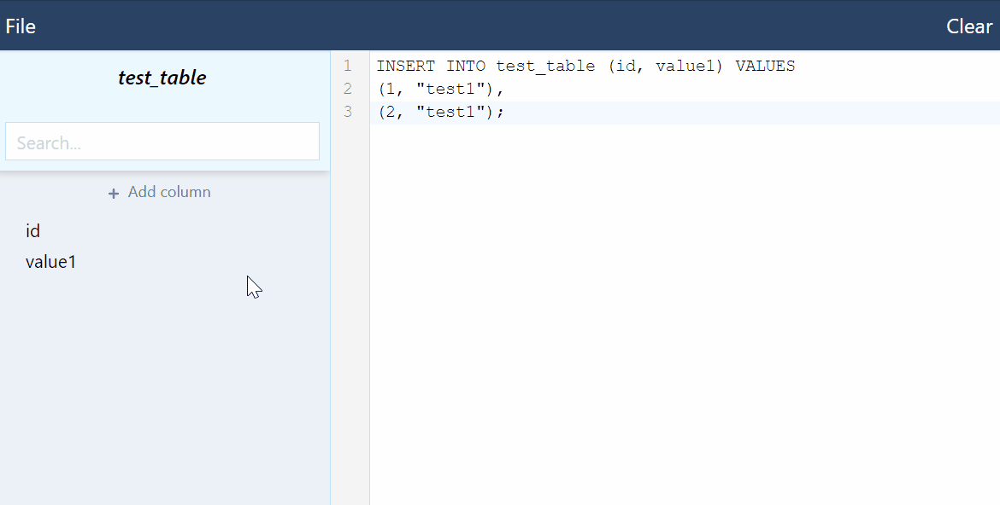
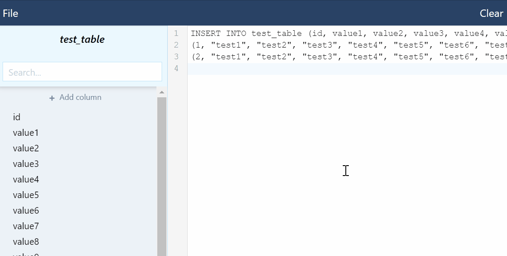

<h1 align="center">
	 QuEdit
</h1>

## Table of Contents
- [Features](#features)
- [Example](#example)
- [Installation](#installation)
    - [Bundling](#bundling)
- [How To Use](#how-to-use)

### Features
- Select all row data of an INSERT SQL statement by column (select "vertically")
- Simply and _very_ quickly change huge SQL statements without the need to go back into phpMyAdmin three, four, five times in a row for the same damn table!
- Support for very, very large SQL statements
- Support for multiple `INSERT INTO` strings at once, for those really huge SQL statements that SQL dumps like to separate
- Support for columns holding serialized/binary data
- Easily add new columns or delete unused ones
- Low RAM footprint while speedy af* - have you ever worked inside phpMyAdmin for a whole day and needed to restart Chrome entirely due to RAM usage??!

\* Hardware limitations apply :} 

### Example
TODO

### Installation
2 very easy steps:
1. `git clone https://github.com/dsone/quedit.git && cd quedit`
2. `npm install`

#### Bundling
To actually use this repository as an Electron app, you need to bundle it into a package for your operating system first.  
In the Installation step above you have already installed everything that is necessary to do just that!  
  
Go into the QuEdit folder with a terminal programm of your choice and type in `npm run build`.  
The electron packager will now create a bundled version of QuEdit according to your OS specifics.  
When the packager is done, there is a new folder called "_electron-build_".  
Inside that folder is one or more folder with an Electron app compatible with your OS.
  
Read more about packaging here:
https://www.electronjs.org/docs/tutorial/quick-start#package-and-distribute-the-application

### How to use

#### Startup
Once you have an application built as described above, you can start the app by clicking the app icon.  
Inside the app, there are two basic areas: Left side is the sidebar, for now that is empty.
On the right side is the texteditor you'll work with and where you'll paste/enter your (complete) `INSERT` SQL statement in.
  
#### Entering INSERT INTO SQL statements
That statement can be an exported SQL string for a table from tools like phpMyAdmin, or coming from a mySQL dump file.  
You can also open an SQL file via the button "File" on the top left.  
Or, if you want, start typing in your custom INSERT SQL statement manually in the text editor, like this:  

  

Just make sure that you only use the `INSERT INTO tableName (...) VALUES (...)` part of any SQL dump. If you use text that contains multiple `INSERT INTO` statements, QuEdit will notify you that it detected this.  
If these statements are compatible, ie. they target the same table with the same columns, QuEdit will be ignoring the redundant INSERT INTOs and remove them once you start making changes via the sidebar (see below). If they are not compatible, QuEdit will notify about this, too and you won't be able to change the statements with QuEdit. Remove all but one statement, or all statements that are incompatible to one another.
  
#### Making changes
Once your manually entered, copied or a via "File" opened statement is valid, QuEdit will catch up on that and display all found columns in your statement on the left side.  
These columns are clickable: if you click one (making it "active"), the text editor will only show the value of the clicked column for each row of your statement in the text editor.  
To see the entire SQL statement again, just click the active column again to deselect. If you wish, you might change some or all values while a column is selected.  
Once you deselect - or select another column to change that, too - your entire SQL statement will have the new values automagically.  
In case you accidentally delete a row and deselect, QuEdit will show you a notification that the amount of rows for that column doesn't match the row count for all other columns and revert to the last valid SQL statement.  
  
Although, beware that QuEdit does not assume any datatypes for your data. You might change data from `int` to `string`, while your database wants `int` still.  
QuEdit will not know about that and won't prevent you from doing that.

### Tooltips
When you click around or move the text cursor by arrow keys in the text editor with a valid SQL statement present, you'll get to see a tooltip popping up shortly.  
This is useful for very large rows, as it displays the name of the column your cursor is in at any given time.  
Was it too quick? Move the cursor via keyboard or click again on the text.

#### Delete a column
If you want to delete a specific column for all rows, do that while no columns are selected on the left.  
Then, just hover over the column to delete and click the trash icon that appears on the right side of the column name.  
This will delete the column in all rows for you.

#### Add a new column
Sometimes you need to do the opposite and add a new colum. This can be done via the "+ Add new column" above the existing columns.  
If you do not see it, you need to scroll back up in the sidebar. ;)  
When clicked, a modal dialog will ask your for the name of the new column. By default, an empty string will be set as the value and the column will be added at the end of your SQL statement.

#### Search 
Above the columns is a search to filter the clickable columns. In case you have a lot, really a looot of columns to go through.  
Simply click the X next to the search input to reset the display and see all columns again, or remove the input manually.
